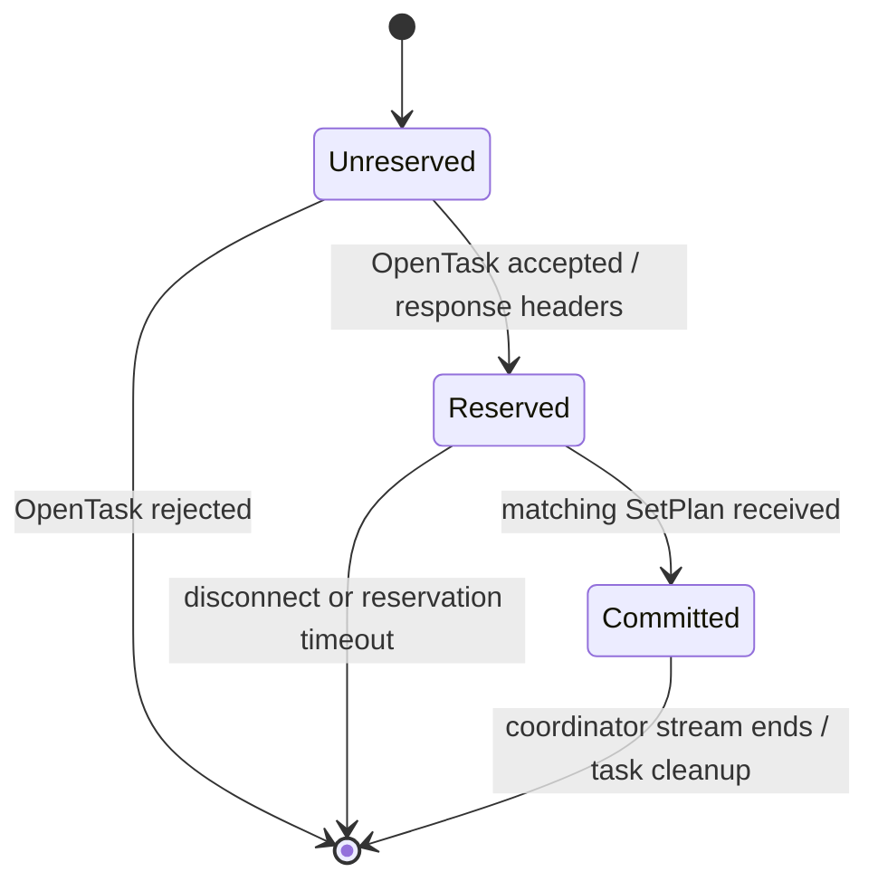
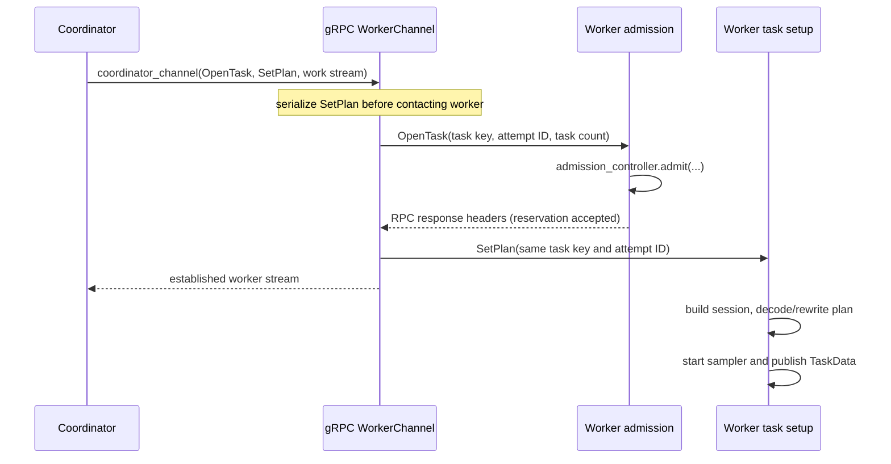

# RFC 0640: Worker admission and ambiguity-safe task retries

- Status: Draft
- Tracking issue: [#640](https://github.com/datafusion-contrib/datafusion-distributed/issues/640)
- Prototype: implemented with this RFC

## Summary

Split coordinator-channel setup into an execution-side-effect-free reservation and an explicit
commit:

1. The coordinator serializes the plan locally and sends `OpenTaskRequest` with a fresh attempt ID.
2. The worker runs a user-provided `WorkerAdmissionController` without decoding the plan, building a
   session, publishing task state, or starting a sampler.
3. Accepting the streaming RPC response acknowledges the reservation.
4. Only after receiving that acknowledgement does the gRPC client release the matching
   `SetPlanRequest`. `SetPlanRequest` is the commit point and worker-side task setup may then begin.
5. Admission rejections carry a worker-authored retry directive: retry the same worker, retry a
   different worker, or do not retry.

This gives the coordinator a protocol fact stronger than a gRPC status-code guess: before commit,
retry is safe; after commit, automatic placement retry is not safe.

## Background

Before this change the first request-stream message was `SetPlanRequest`. The worker completed all
of the following before returning the RPC response:

```text
StageCoordinator::init_bidirectional_stream
  WorkerChannel::coordinator_channel
    WorkerService::coordinator_channel
      Worker::coordinator_channel
        WorkerSessionBuilder::build_session_state
        MaybeEncoded<ExecutionPlan>::decode
        WorkerPlanRewriteHandlers::handle
        SamplerExec::kick_off_first_sampler
        task_data_entries.write
      return gRPC response headers
```

`SamplerExec::kick_off_first_sampler` can pull lower stages, so setup is not idempotent. If the
worker reached that frame but the response headers were delayed or lost, the coordinator saw only a
timeout. Retrying `SetPlanRequest` on another worker could start a second copy while the first copy
was already running.

The ambiguous failure looked like this:

```text
Coordinator                               Worker A                       Worker B
    | SetPlan(task, attempt A)                |                              |
    |---------------------------------------->|                              |
    |                                         | build session                |
    |                                         | decode/rewrite plan           |
    |                                         | start sampler ───────┐        |
    |                                         | publish task state   |        |
    |             response headers (lost) <---|                      |        |
    | timeout                                 |                      |        |
    | SetPlan(task, attempt B) -------------------------------------------->|
    |                                         | lower-stage work <───┘        | start sampler
```

Classifying this from `tonic::Code` cannot prove whether the worker crossed the side-effect
boundary. In particular, `DEADLINE_EXCEEDED` can be returned even when a state-changing operation
completed, and `UNAVAILABLE` is not by itself an idempotency guarantee.

## Goals

- Let workers make admission decisions before expensive or externally visible task setup.
- Let a worker explicitly say whether an admission failure is retryable and where to retry it.
- Make transport ambiguity safe without requiring session builders, plan codecs, or samplers to be
  idempotent.
- Release reserved capacity when a client disconnects or never commits.
- Preserve the library's transport abstraction and allow custom admission policies.

## Non-goals

- Retrying a task after `SetPlanRequest` has committed.
- Recovering a query after a worker fails during task execution.
- Reserving all workers for the entire stage graph atomically.
- Defining a cluster-wide scheduler or resource model.

## Decision

### Protocol state machine



The safety invariant is:

> A worker MUST NOT build the task session, decode or rewrite the plan, start sampling, pull work
> from lower stages, or publish task state before receiving a matching `SetPlanRequest` for an
> accepted `OpenTaskRequest`.

Admission may acquire capacity, but it must return that capacity as an RAII
`WorkerAdmissionPermit`. The permit is dropped if the reservation is abandoned and is retained in
`TaskData` after commit.

### Happy path



The gRPC client gates `SetPlanRequest` behind a one-shot signal released only after it observes the
RPC response. Therefore a proxy may lose or delay the response headers indefinitely without the
worker starting task setup.

### Attempt identity

Every placement attempt gets a new UUID. Both messages carry:

- `task_key`
- `attempt_id`
- `task_count`

The worker rejects a commit if any field differs from the accepted reservation. This prevents a
stale or cross-wired commit from consuming the wrong reservation.

### Worker admission API

Workers can install a controller with `Worker::with_admission_controller`:

```rust
#[async_trait]
pub trait WorkerAdmissionController: Send + Sync {
    async fn admit(
        &self,
        request: &WorkerAdmissionRequest,
    ) -> Result<WorkerAdmissionPermit, WorkerAdmissionRejection>;
}
```

`WorkerAdmissionRequest` exposes only task identity, task count, and propagated headers. Excluding
the plan makes it harder for an admission implementation to accidentally repeat the unsafe setup
work.

`WorkerAdmissionRejection` supports:

- `fatal(error)`: do not retry;
- `retry(error, RetryTarget::SameWorker)`;
- `retry(error, RetryTarget::DifferentWorker)`.

The default controller accepts every request and returns an empty permit, preserving current
behavior for users who do not configure admission.

### Structured error transport

Worker retry intent is encoded in gRPC status details, adjacent to the serialized
`DataFusionError`:

```text
RetryableDataFusionErrorProto
  error: DataFusionErrorProto
  retry_target: SAME_WORKER | DIFFERENT_WORKER
```

The coordinator decodes this envelope into a typed internal retry marker. It does not inspect the
error string or infer admission semantics from gRPC status codes.

Transport failures before the response headers are a separate case: because the client has not
released `SetPlanRequest`, the protocol itself proves that failover is safe. Untyped errors after
commit arrive on the established response stream and are query errors; they do not re-enter task
routing.

### Error handling

| Failure point | Worker state | Retry action | Rationale |
|---|---|---|---|
| Plan serialization on coordinator | unreserved | none | Deterministic local error; no worker was contacted. |
| Untyped transport failure before reservation acknowledgement | uncommitted | different worker | `SetPlan` is still gated, so no task side effects occurred. |
| Worker admission rejection: same worker | uncommitted | same worker with configured backoff | Worker explicitly requested a local retry. |
| Worker admission rejection: different worker | uncommitted | different worker | Worker explicitly requested failover, e.g. local pressure. |
| Worker admission rejection: fatal | uncommitted | none | Authentication, configuration, or other non-transient failure. |
| Disconnect or timeout while reservation waits for `SetPlan` | reservation dropped | none on worker | RAII permit is released; task state was never constructed. |
| Mismatched task key, attempt ID, or task count | uncommitted | none | Protocol violation; never commit an uncertain reservation. |
| Session build, plan decode/rewrite, or sampler kickoff failure | committed | none | Retrying placement could duplicate side effects. |
| Execution-stream transport failure | committed/running | none | Requires query/task recovery semantics outside this RFC. |

### Failure propagation call stacks

Worker-authored admission rejection:

```text
WorkerAdmissionController::admit
  -> WorkerAdmissionRejection { error, retry_target }
  -> WorkerService::coordinator_channel
  -> RetryableDataFusionErrorProto in tonic::Status.details
  -> grpc WorkerChannel::coordinator_channel
  -> RetryOutcome (typed, internal)
  -> RandomRouteTaskHandler::dial_with_failover
```

Post-commit setup failure:

```text
Worker::coordinator_channel_with_permit
  -> session / codec / rewrite / sampler error
  -> first WorkerToCoordinator stream error
  -> StageCoordinator response-stream task
  -> query error (does not call RouteTaskHandler again)
```

### Reservation lifetime

An accepted reservation waits 30 seconds for `SetPlanRequest` by default. Users can change this via
`Worker::with_task_reservation_timeout`. A disconnected request stream or timeout drops the permit.
After commit, the permit moves into `TaskData` and lives until the worker removes that task entry.

## Compatibility and rollout

This changes both the `WorkerChannel::coordinator_channel` API and the first message of the gRPC
stream, so it is a DataFusion Distributed 5.0 breaking change.

Coordinator and worker binaries must be upgraded together. A 5.0 coordinator sends `OpenTaskRequest`
first; an older worker expects `SetPlanRequest`. A 5.0 worker rejects an older coordinator because it
does not receive an admission request first. Deployments requiring rolling mixed-version operation
should keep old and new worker pools separate and route coordinators only to the matching pool.

Custom `WorkerChannel` implementations must accept both `OpenTaskRequest` and `SetPlanRequest` and
must preserve their ordering guarantee. In-process channels run admission then commit directly;
there is no ambiguous transport boundary between those steps.

## Observability

Existing coordinator retry counters continue to distinguish same-URL and other-URL retries. A
follow-up may add admission latency, rejection reason, active reservation, expiration, and
commit-latency metrics after the community agrees on metric cardinality and reason-code policy.

Attempt IDs should be included in structured tracing spans but must not become unbounded metric
labels.

## Test strategy

The implementation includes tests that:

- round-trip same-worker and different-worker retry directives through `tonic::Status` details;
- prove retry markers are typed and are not inferred from error text;
- open a real in-memory gRPC stream, withhold `SetPlanRequest`, and verify response headers arrive
  while the worker has built zero sessions and published zero task entries;
- exercise ordinary distributed queries through the existing integration suite.

The deterministic withheld-commit test is the regression test for the issue #640 race. Chaos tests
remain useful for broader failure coverage, but they are not the proof of this ordering invariant.

## Alternatives considered

### 1. Keep one-step `SetPlan` and classify gRPC status codes

Pros:

- smallest wire change;
- already supported by the current routing retry loop.

Cons:

- status codes do not identify whether worker-side effects happened;
- worker overload and transport ambiguity are conflated;
- coordinator policy must know worker failure semantics.

Rejected because it cannot make ambiguous timeout retry safe.

### 2. Make `SetPlan` idempotent with an attempt registry

Pros:

- could support replay after a lost response;
- may become useful for future task recovery.

Cons:

- requires durable or carefully scoped deduplication state;
- does not undo external effects from session builders, codecs, hooks, or data sources;
- requires cached outcomes and cleanup rules for every attempt.

Not implemented. It is substantially broader than admission safety.

### 3. Separate unary `ReserveTask` and streaming `SetPlan` RPCs

Pros:

- explicit acknowledgement message and simple RPC semantics;
- reservation can be managed independently.

Cons:

- requires a worker-side reservation registry shared across RPCs;
- adds cleanup races and another public transport method;
- authentication/headers must be correlated across calls.

The selected design gets the same ordering guarantee inside the existing stream and lets stream
cancellation own reservation cleanup.

### 4. Send an in-band `TaskReserved` response message

Pros:

- explicit protocol event;
- could carry reservation metadata.

Cons:

- the response stream cannot produce that message until the RPC response itself exists, so headers
  already provide the required acknowledgement;
- introduces another message that every response consumer must handle.

Deferred unless future negotiation needs additional reservation data.

### 5. Reserve the complete static stage graph before committing any task

Pros:

- stronger all-or-nothing capacity planning;
- can avoid partial graph startup under known static demand.

Cons:

- distributed rollback and lease coordination are much more complex;
- dynamic task counts and runtime work-unit feeds make demand uncertain;
- head-of-line blocking and reservation hoarding can reduce utilization.

Not prototyped in this PR. The per-task admission primitive can be used by a future graph-level
scheduler without committing this library to one scheduling policy.

## Follow-ups

- Decide whether admission should receive coarse plan resource hints without exposing the plan.
- Add stable, low-cardinality admission reason codes and retry-after hints if real policies need
  them.
- Add capability negotiation if mixed-version worker pools become a supported deployment mode.
- Design post-commit task recovery separately, with explicit idempotency and output ownership.

## References

- [Issue #640: Retry / recover when workers fail](https://github.com/datafusion-contrib/datafusion-distributed/issues/640)
- [PR #667: distributed query chaos test](https://github.com/datafusion-contrib/datafusion-distributed/pull/667)
- [PR #712: coordinator-channel retry loop](https://github.com/datafusion-contrib/datafusion-distributed/pull/712)
- [Deterministic withheld-response reproducer](https://github.com/lesam/datafusion-distributed/pull/1)
- [gRPC status-code semantics](https://grpc.io/docs/guides/status-codes/)
